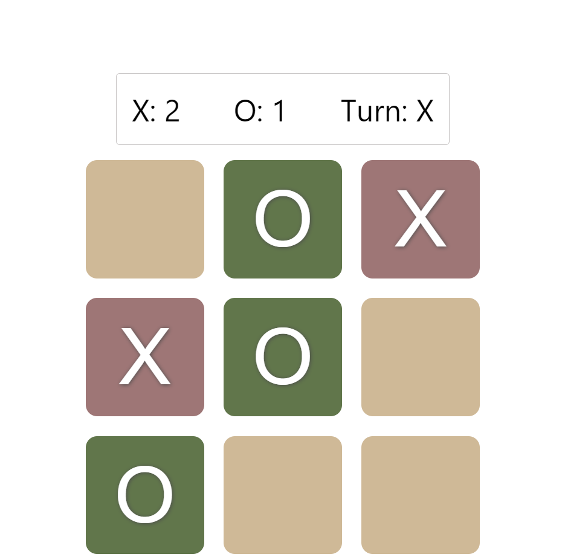
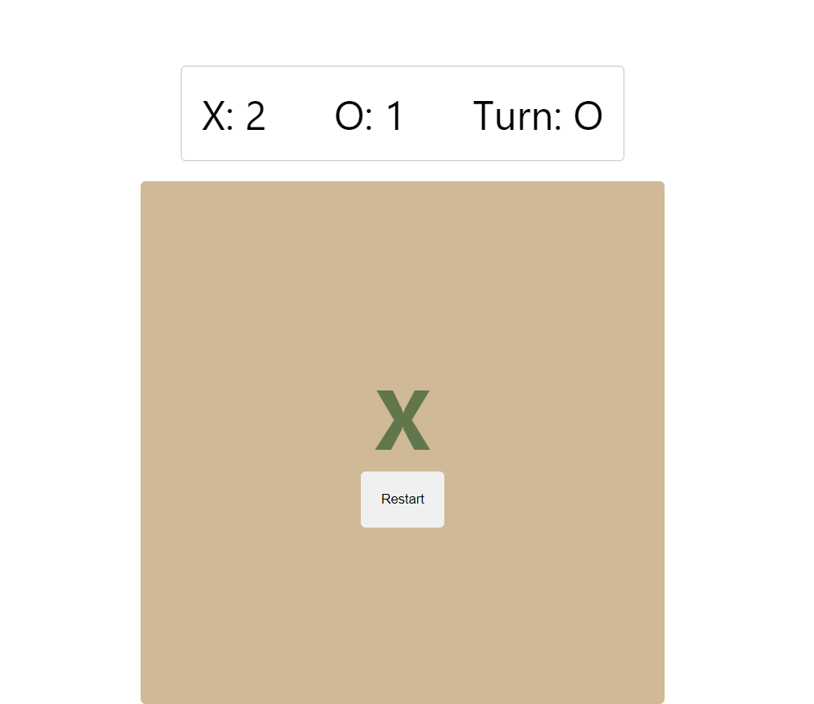
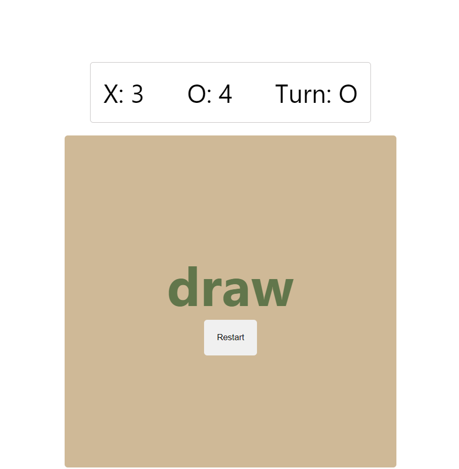

# TicTacToe

A classic Tic Tac Toe game. This game allows two players to play against each other and the first player to get three consecutive X or O in a row, column or diagonal wins the game.

## Features

- Game board with 9 cells
- Players can place X or O in each cell

- The first player to get three consecutive X or O in a row, column or diagonal wins the game

- The game ends in a draw if all cells are filled and no player has won

## Technologies used
- React
- JavaScript
- CSS
- HTML

## Installation and Setup Instructions

To clone down this repository. You will need node and npm installed globally on your machine.

**Installation:**

npm install

**To Run Test Suite:**

npm test

**To Start Server:**

npm start

**To Visit App:**

http://localhost:3000/view